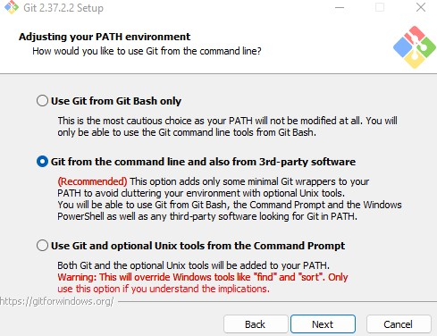
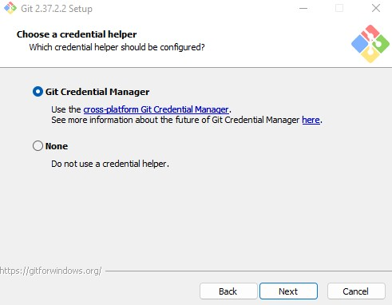
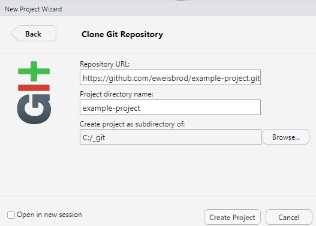

This repository (repo) provides a template for an Accounting / Finance research project.

## Table of Contents

* [Introduction](#intro)
* [How to Use These Materials](#usethese)
* [Getting Started with R and Git](#getstart)
* [Forking This Repository](#fork)
* [Additional Resources] (#links)

##  <a name="intro"></a>Introduction 
The code in this repository can generate output for both LaTeX and MS Office.
There is an associated LaTeX template that is publicly viewable on Overleaf at: <https://www.overleaf.com/read/ctmwnmdcypzh>

The Overleaf page provides an example LaTeX template for writing a paper, as well as displays the Latex output generated by the code in this repository.

The LaTeX template will produce this example PDF which demonstrates the tables we will make in this project: [view pdf](./assets/Paper_Template.pdf).

The goal of the example is to help researchers learn the basics of: \* Installing RStudio and Git.
* Downloading data from WRDS using either SAS or R (using the WRDS postgresql server in R).
* Some data manipulation in SAS or R, including basic SAS macros and R functions for winsorizing data, etc. \* Moving datasets between SAS, Stata, and R.
* Producing publication-ready tables generated in Stata or R, and output in MS Word, MS Excel, or Latex.
* Miscellaneous tips and tricks that assist with coauthor collaboration, formatting, etc.

This project began as an example of a basic research project coded entirely in R.
Along those lines, I have provided some instructions to attempt to help users get set up with their R installation.

I have now expanded the scope of the project to provide equivalent code to execute the project entirely in SAS and Stata instead of R.

Personally, my current workflow relies on both SAS and R, and I have moved away from Stata where possible.
The project includes an attached slide deck listing some pros and cons of the various software packages.

## <a name="usethese"></a> How To Use These Materials 

One way to use the material in this repository is to simply browse through the code in your web browser and either download or copy/paste any parts that are useful to you.
If you are viewing this on GitHub, the folder structure probably appears above this ReadMe content.
You can also click the "Code" tab at the top of the page if needed.
Files are organized as follows:

-   The src folder contains the relevant SAS, R, and Stata code
-   The theme folder contains an optional RStudio theme and font
-   The etc folder contains the screenshots used on the site
-   There is a powerpoint file in the main/root directory with some brief introductory slides that I use during live presentations for new R users.

A second, arguably better, way to use this material would be to "clone" the material to your local machine, using a Git client such as RStudio.
If you are familiar with Git or Github, it is probably better to fork your own version of this repository and then clone that.
Instructions for getting set up with R and Git appear below.

Please feel free to use these materials in your work or share them with others.
Please leave a link / attribution to this repository when sharing.
I may come up with a better way to cite these materials, but for now if you are able to work in a citation to one of my recent papers that developed some of the code here:

BOCHKAY, K., MARKOV, S., SUBASI, M.
and WEISBROD, E.
(2022), The Roles of Data Providers and Analysts in the Production, Dissemination, and Pricing of Street Earnings.
Journal of Accounting Research, 60: 1695-1740.
<https://doi.org/10.1111/1475-679X.12457>

code appendix: <https://www.chicagobooth.edu/research/chookaszian/journal-of-accounting-research/online-supplements-and-datasheets/volume-60>

or my dissertation paper:

WEISBROD, E.
(2019), Stockholders' Unrealized Returns and the Market Reaction to Financial Disclosures.
The Journal of Finance, 74: 899-942.
<https://doi.org/10.1111/jofi.12743>

it would be much appreciated.

##  <a name="getstart"></a>🛠️ Getting Started with R and Git

In order to "clone" (copy) this repository to your machine and follow along with the R workshop, you will need to install Git, R, RStudio, and several R packages to your machine.
I will provide the installation steps for a Windows machine, but the steps are very similar for MacOS or Linux.

### 1. Install Git

-   Follow the steps at this link: <https://git-scm.com/book/en/v2/Getting-Started-Installing-Git>

I think it is a good idea to allow this option to install git into your PATH so that RStudio can find it.



It is also helpful to allow git to install the credential manager to help with storing your github credentials.



-   Finally, I also recommend to install / allow Git bash during the installation.

### 2. Install R

-   Before you install RStudio, you should first install R from the following link: <https://cran.rstudio.com/>

If you already have R on your machine, I recommend at least R version 4.0 or better to follow along with the code in this repo.
If you use an older version of R, you may see some warnings about R packages being built with a different version, but usually everything will still work.

### 3. Install RStudio

-   Install RStudio Desktop from the following link: <https://www.rstudio.com/products/rstudio/download/#download>


As shown in the screenshot, R should be installed first, as we did in the previous step.

### 4. Sign up for a Github account

-   If you have not done so already, register for an account at <https://github.com/>

-   There are some benefits to linking your Github account to your school email (<https://education.github.com/benefits>).

-   Below, I recommend that you use the same primary email address that you use for github when you set your user.email in git.
    You can use a personal email as your primary email on Github and also link your Github account to your (secondary) school email as well, if desired.

### 5. Open RStudio and set your Git credentials

-   To work with Git, you need to set your user name and email.
-   There are many ways to do this, but an easy way is using RStudio's built-in terminal.


-   Click on the "terminal" tab that should be next to console.
-   Type the following commands

```         
git config --global user.email "your@email.com"
```

```         
git config --global user.name "Your Name"
```

-   NOTE: If this step doesn't work, don't worry. Just keep going. This might not work if you did not install Git bash, but you should still be able to keep going.

##  <a name="fork"></a>Forking this Repository 


-   <b><ins> IMPORTANT: You need to create a local directory to hold the local copy of this repository on your computer.
    DO NOT put this directory inside Dropbox.
    Dropbox and Git do not play well together unless you are an advanced user.
    I recommend to use a simple directory on your main drive that is easy to find.
    </b></ins>

-   At the top of this page, click the green code button and copy the https link to this repo.


-   In RStudio, click File -\> New Project.
    On the next menu, click "Version Control" and choose Git.

-   Paste the URL into the box, as follows:



-   Click "Create Project"

<p><b> 7.
Open the "--Install-Packages.R" script in the "src" folder in RStudio </b></p>

-   Run the commands in this file by highlighting them and pushing "ctrl+Enter" or by highlighting them and clicking "run."

-   If you are able to successfully connect to WRDS you should see a line like this output in your console:


-   If you were able to successfully install the packages and connect to WRDS, you should now be ready to follow along for the coding workshop.
